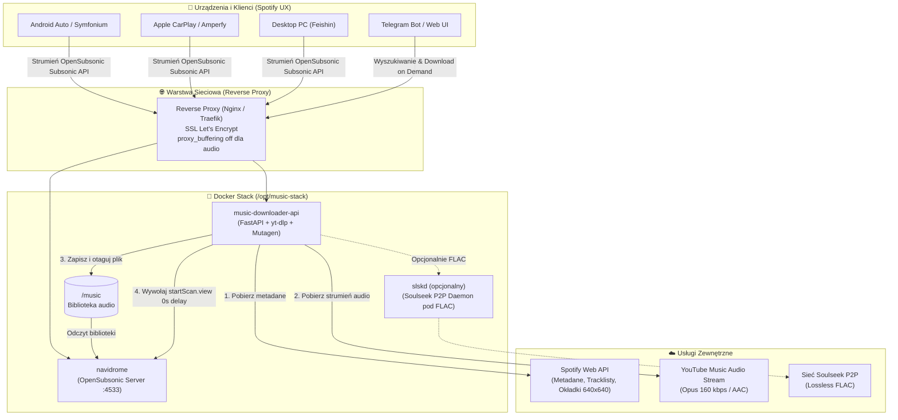

# 🎵 Spoti-Stack: Prywatny, Self-Hosted Ekosystem Muzyczny

Kompletna, bezpłatna alternatywa dla Spotify oparta na kontenerach **Docker**, serwerze **Navidrome** (protokół OpenSubsonic) oraz dedykowanym mikroserwisie **Music Downloader API** umożliwiającym buforowanie i pobieranie muzyki na żądanie (*Download-on-Demand*) ze Spotify oraz YouTube Music w zoptymalizowanym formacie **Opus (~160 kbps)** lub bezstratnym **FLAC**.

---

## 📑 Spis treści
1. [Architektura systemu](#-architektura-systemu)
2. [Dlaczego format Opus ~160 kbps?](#-dlaczego-format-opus-160-kbps)
3. [Struktura projektu](#-struktura-projektu)
4. [Wymagania wstępne](#-wymagania-wstępne)
5. [Instrukcja wdrożenia krok po kroku (Debian)](#-instrukcja-wdrożenia-krok-po-kroku-debian)
6. [Konfiguracja Spotify Web API](#-konfiguracja-spotify-web-api)
7. [Konfiguracja Navidrome i natychmiastowego reskanu](#-konfiguracja-navidrome-i-natychmiastowego-reskanu)
8. [Reverse Proxy (Nginx & Traefik) + SSL Let's Encrypt](#-reverse-proxy-nginx--traefik--ssl-lets-encrypt)
9. [Konfiguracja aplikacji klienckich (Spotify UX)](#-konfiguracja-aplikacji-klienckich-spotify-ux)
   - [Android & Android Auto (Symfonium)](#android--android-auto-symfonium)
   - [iOS & Apple CarPlay (Amperfy / Substreamer)](#ios--apple-carplay-amperfy--substreamer)
   - [Desktop PC (Feishin / Sonixd)](#desktop-pc-feishin--sonixd)
   - [TV / Google Cast / DLNA](#tv--google-cast--dlna)
10. [Ekspansja i integracje (Telegram Bot & Soulseek FLAC)](#-ekspansja-i-integracje)
11. [Diagnostyka i zarządzanie](#-diagnostyka-i-zarządzanie)

---

## 🏛️ Architektura systemu



### Przepływ „Download-on-Demand”:
1. **Wyszukanie**: Użytkownik wkleja link Spotify (lub wpisuje nazwę utworu/albumu) w Web Dashboardzie, przez API lub na czacie Telegrama.
2. **Ekstrakcja metadanych**: API odpytuje oficjalne **Spotify Web API** – pobiera precyzyjny tytuł, wykonawcę, album, numer ścieżki, rok, kod ISRC oraz okładkę w rozdzielczości 640x640.
3. **Pobranie audio**: W tle w 2–4 sekundy `yt-dlp` pobiera bezpośredni strumień YouTube Music Audio w natywnym kontenerze **Opus** bez zbędnej ponownej kompresji.
4. **Wzorcowe tagowanie**: Biblioteka `mutagen` osadza komentarze Vorbis oraz okładkę w standardzie `METADATA_BLOCK_PICTURE`.
5. **Struktura katalogów**: Plik trafia do `/music/{Artist}/{Album}/{TrackNumber} - {Title}.opus`.
6. **Natychmiastowy reskan**: API uderza do endpointu Navidrome (`/rest/startScan.view`) – utwór natychmiast pojawia się w odtwarzaczu na telefonie i w samochodzie.

---

## ⚡ Dlaczego format Opus ~160 kbps?

Wybór formatu **Opus** o przepływności ~160 kbps to optymalny balans technologiczny w nowoczesnych systemach audio:
- **Jakość percepcyjna**: Opus przy 160 kbps przewyższa jakościowo MP3 320 kbps i jest całkowicie transparentny dla ludzkiego ucha (nawet na profesjonalnym nagłośnieniu studyjnym i car-audio).
- **Oszczędność miejsca**: Plik albumu (12 utworów) w MP3 320 kbps zajmuje ~120 MB. W Opus 160 kbps zajmuje **zaledwie ~55 MB** (redukcja o ponad 50% na dysku SSD).
- **Szybkość buforowania w trasie**: Pliki o mniejszym rozmiarze buforują się natychmiast w CarPlay / Android Auto, nawet przy słabym zasięgu LTE/3G.
- **Natywny strumień**: YouTube Music koduje dźwięk w Opus/WebM (itag 251) – `yt-dlp` kopiuje strumień bezpośrednio, dzięki czemu proces pobierania trwa zaledwie **2–3 sekundy**.

---

## 📁 Struktura projektu

```text
/opt/music-stack/
├── .env                          # Zmienne środowiskowe i klucze API
├── .env.example                  # Wzorzec konfiguracji
├── docker-compose.yml            # Orkiestracja Navidrome, API i SLSKD
├── music/                        # Główna biblioteka muzyczna (/music)
│   └── {Artist}/
│       └── {Album}/
│           └── 01 - {Title}.opus
├── data/                         # Dane trwałe aplikacji
│   ├── navidrome/                # Baza danych SQLite i cache Navidrome
│   ├── downloader/               # Pliki tymczasowe API
│   └── slskd/                    # Konfiguracja daemona Soulseek (opcjonalnie)
├── music-downloader-api/         # Mikroserwis pobierający
│   ├── Dockerfile
│   ├── requirements.txt
│   ├── main.py                   # FastAPI + Web UI Dashboard
│   ├── config.py                 # Pydantic Settings
│   ├── spotify_client.py         # Klient Spotify Web API
│   ├── downloader.py             # Silnik yt-dlp + architektura zadań
│   ├── tagger.py                 # Tagowanie Mutagen (Opus/FLAC/MP3)
│   ├── navidrome_client.py       # Klient Subsonic startScan
│   ├── tasks.py                  # Menedżer kolejki zadań w tle
│   └── telegram_notifier.py      # Powiadomienia na czat
├── reverse-proxy/
│   ├── nginx/
│   │   ├── nginx.conf
│   │   └── conf.d/music.conf     # Konfiguracja vhost z proxy_buffering off
│   └── traefik/
│       └── traefik.yml           # Konfiguracja Traefik + Let's Encrypt
└── scripts/
    ├── deploy.sh                 # Zautomatyzowany instalator dla Debiana
    ├── test_download.sh          # Skrypt CLI do testu pobierania
    └── telegram_bot.py           # Opcjonalny bot Telegram do zamawiania utworów
```

---

## 📋 Wymagania wstępne

- Serwer z systemem **Debian 11 (Bullseye)** lub **Debian 12 (Bookworm)** (działa również na Ubuntu 22.04/24.04).
- Uprawnienia roota (`sudo`).
- Porty otwarte na firewallu: `80`, `443` (dla Reverse Proxy) oraz wewnętrznie `4533` (Navidrome) i `8000` (Downloader API).
- Zarejestrowana domena lub subdomena (np. `music.twojadomena.pl`) skierowana na publiczny adres IP serwera.

---

## 🚀 Instrukcja wdrożenia krok po kroku (Debian)

### Krok 1: Klonowanie repozytorium lub wdrożenie skryptem

Zaloguj się na swój serwer Debian przez SSH:

```bash
# Sklonuj repozytorium do katalogu tymczasowego lub bezpośrednio do /opt/music-stack
sudo git clone https://github.com/twoj-login/spoti-stack.git /opt/music-stack
cd /opt/music-stack
```

Uruchom w pełni zautomatyzowany skrypt instalacyjny:

```bash
sudo chmod +x scripts/deploy.sh scripts/test_download.sh
sudo ./scripts/deploy.sh
```

Skrypt automatycznie:
1. Zaktualizuje pakiety systemowe i zainstaluje `ffmpeg`, `curl`, `ca-certificates`.
2. Zainstaluje oficjalny Docker Engine oraz Docker Compose v2.
3. Utworzy strukturę katalogów z uprawnieniami `chown -R 1000:1000`.
4. Przygotuje plik `.env` i uruchomi kontenery w tle.

---

## 🔑 Konfiguracja Spotify Web API

Aby pobierać oficjalne metadane, okładki 640x640 i pełne tracklisty albumów/playlist ze Spotify, wymagane są darmowe klucze z portalu deweloperskiego Spotify:

1. Wejdź na [developer.spotify.com/dashboard](https://developer.spotify.com/dashboard) i zaloguj się darmowym kontem Spotify.
2. Kliknij **Create App**:
   - **App Name**: `SpotiStack`
   - **App Description**: `Self-hosted personal music bridge`
   - **Redirect URI**: `http://localhost:8000/callback` (lub dowolny)
   - W sekcji *Which API/SDKs are you planning to use?* zaznacz **Web API**.
3. Po utworzeniu aplikacji przejdź do **Settings** i skopiuj:
   - **Client ID**
   - **Client Secret** (kliknij *View client secret*)
4. Wklej je do pliku `/opt/music-stack/.env`:
   ```bash
   SPOTIFY_CLIENT_ID=twoj_skopiowany_client_id
   SPOTIFY_CLIENT_SECRET=twoj_skopiowany_client_secret
   ```
5. Przeładuj kontener API:
   ```bash
   docker compose restart music-downloader-api
   ```

---

## 🔄 Konfiguracja Navidrome i natychmiastowego reskanu

1. Otwórz w przeglądarce adres: `http://IP_SERWERA:4533`.
2. Przy pierwszym uruchomieniu zostaniesz poproszony o utworzenie konta administratora:
   - **Username**: `admin` (lub wybrana przez Ciebie nazwa)
   - **Password**: Podaj bezpieczne hasło
3. Zaktualizuj plik `/opt/music-stack/.env`:
   ```bash
   NAVIDROME_ADMIN_USER=admin
   NAVIDROME_ADMIN_PASSWORD=twoje_haslo_administratora
   ```
4. Zrestartuj kontener API:
   ```bash
   docker compose restart music-downloader-api
   ```

> [!TIP]
> **Dlaczego to jest ważne?**
> Dzięki podaniu hasła administratora w `.env`, mikroserwis `music-downloader-api` po każdym pobranym utworze natychmiast wywołuje wewnętrzny endpoint Subsonic API (`/rest/startScan.view`) z hashem salt+token MD5. Nowa piosenka pojawia się w bibliotece natychmiast (0 sekund opóźnienia), bez czekania na cykliczny skan crona!

---

## 🛡️ Reverse Proxy (Nginx & Traefik) + SSL Let's Encrypt

### Wariant A: Nginx (Rekomendowany)

Skorzystaj z gotowego pliku konfiguracyjnego `reverse-proxy/nginx/conf.d/music.conf`.

1. Zainstaluj Certbot na serwerze:
   ```bash
   sudo apt install -y certbot python3-certbot-nginx
   sudo certbot certonly --standalone -d music.twojadomena.pl -d dl.music.twojadomena.pl
   ```
2. Skopiuj pliki Nginx:
   ```bash
   sudo cp reverse-proxy/nginx/nginx.conf /etc/nginx/nginx.conf
   sudo cp reverse-proxy/nginx/conf.d/music.conf /etc/nginx/conf.d/music.conf
   ```
3. Podmień `music.twojadomena.pl` na swoją właściwą domenę.
4. Przeładuj Nginx:
   ```bash
   sudo nginx -t && sudo systemctl reload nginx
   ```

> [!IMPORTANT]
> **Kluczowa reguła strumieniowania audio:**
> W pliku `music.conf` sekcja:
> ```nginx
> location ~* ^/(rest|api)/stream {
>     proxy_pass http://navidrome:4533;
>     proxy_buffering off;
>     proxy_cache off;
>     proxy_http_version 1.1;
>     proxy_read_timeout 1200s;
> }
> ```
> wyłącza buforowanie proxy (`proxy_buffering off`). Zapobiega to przerywaniu utworów w telefonie i aucie oraz umożliwia natychmiastowe przeskakiwanie (seeking) po osi czasu piosenki.

---

## 📱 Konfiguracja aplikacji klienckich (Spotify UX)

### Android & Android Auto (Symfonium)
Aplikacja **Symfonium** (dostępna w Google Play) to bezapelacyjnie najlepszy klient Subsonic na Androida, zaprojektowany specjalnie pod kątem ekosystemów self-hosted i nowoczesnego UI w stylu Spotify.

1. **Dodanie serwera:**
   - Otwórz Symfonium -> Dodaj dostawcę mediów -> Wybierz **OpenSubsonic / Subsonic**.
   - **URL**: `https://music.twojadomena.pl`
   - **Login i Hasło**: Twoje konto z Navidrome.
2. **Konfiguracja buforowania (Offline Cache):**
   - Wejdź w *Ustawienia* -> *Pamięć podręczna i odtwarzanie offline*.
   - Ustaw limit pamięci podręcznej (np. 15–30 GB na karcie SD lub pamięci wewnętrznej).
   - Włącz opcję **Automatycznie pobieraj w tle ulubione utwory**.
   - Wybierz opcję: *Preferuj bezpośrednie strumieniowanie bez transkodowania* (ponieważ Twoje pliki to już zoptymalizowany Opus).
3. **Android Auto:**
   - Podłącz telefon kablem USB lub przez bezprzewodowe Android Auto do ekranu samochodu.
   - Symfonium pojawi się bezpośrednio w menu aplikacji multimedialnych na konsoli pojazdu.
   - Działa pełne sterowanie z kierownicy, wyszukiwanie głosowe oraz płynne przełączanie między playlistami.

---

### iOS & Apple CarPlay (Amperfy / Substreamer)
Na urządzeniach z iOS masz do dyspozycji dwie znakomite darmowe aplikacje wspierające **Apple CarPlay**:

1. **Amperfy** (dostępna w App Store):
   - Kliknij `+` -> Wybierz serwer **Subsonic**.
   - Wpisz adres `https://music.twojadomena.pl` oraz dane logowania.
   - W zakładce *CarPlay* w ustawieniach włącz integrację z kokpitem samochodu.
   - Aktywuj *Offline Cache* i pobierz ulubione albumy do pamięci iPhone'a przed dłuższą trasą.
2. **Substreamer**:
   - Alternatywny, bardzo czysty interfejs stylizowany na Spotify z ciemnym motywem i wsparciem dla tekstów piosenek oraz CarPlay.

---

### Desktop PC (Feishin / Sonixd)
Na komputerach z Windows, macOS i Linux najwygodniejszym klientem jest **Feishin**:
- Pobierz z oficjalnego repozytorium: [github.com/jeffvli/feishin](https://github.com/jeffvli/feishin/releases).
- Wybierz protokół **OpenSubsonic**.
- Wpisz serwer `https://music.twojadomena.pl`.
- **Zalety Feishin**:
  - Układ interfejsu niemal identyczny ze Spotify.
  - Natywna obsługa skrótów klawiaturowych (Play/Pause, Next/Prev).
  - Integracja z systemowym panelem multimediów Windows / macOS.
  - Wyświetlanie zsynchronizowanych tekstów piosenek (synced lyrics).
  - Wsparcie dla scrobblingu do Last.fm / ListenBrainz.

---

### TV / Google Cast / DLNA
- **Z telefonu**: Zarówno z aplikacji Symfonium, jak i wbudowanego Web UI Navidrome, jednym kliknięciem ikony Cast wyślesz dźwięk na dowolny telewizor z Chromecastem / Google TV lub głośnik sieciowy.
- **AirPlay**: Użytkownicy iOS mogą strumieniować dźwięk z Amperfy na Apple TV oraz odbiorniki zgodne z AirPlay 2.

---

## 🎛️ Korzystanie z Music Downloader API

### 1. Wbudowany Web Dashboard
Po uruchomieniu stosu wejdź na:
`http://IP_SERWERA:8000` (lub `https://dl.music.twojadomena.pl`)

Interfejs umożliwia:
- Wyszukiwanie muzyki w katalogu Spotify z podglądem okładek.
- Wklejenie bezpośredniego linku do utworu, albumu lub playlisty.
- Wybór formatu: `Opus ~160 kbps` (rekomendowany), `MP3 320 kbps`, `FLAC`.
- Podgląd paska postępu w czasie rzeczywistym.
- Przycisk ręcznego wymuszenia reskanu Navidrome.

### 2. Pobieranie z poziomu terminala (cURL)
```bash
# Pobranie pojedynczego utworu ze Spotify
curl -X POST "http://localhost:8000/download" \
     -H "Content-Type: application/json" \
     -d '{"query_or_url": "https://open.spotify.com/track/4cOdK2wGLETKBW3PvgPWqT", "format": "opus"}'

# Pobranie całego albumu
curl -X POST "http://localhost:8000/download" \
     -H "Content-Type: application/json" \
     -d '{"query_or_url": "https://open.spotify.com/album/4m2880jivSbbyEGAKfITCa", "format": "opus"}'

# Sprawdzenie stanu zadania
curl "http://localhost:8000/tasks/TASK_ID"
```

---

## 🤖 Ekspansja i integracje

### A. Bot Telegram do zamawiania muzyki
W katalogu `scripts/telegram_bot.py` znajduje się gotowy bot:
1. Skonfiguruj token bota w `.env`:
   ```bash
   TELEGRAM_BOT_TOKEN=123456789:ABCdefGhIJKlmNoPQRsTUVwxyZ
   TELEGRAM_CHAT_ID=twoje_id_czatu
   ```
2. Uruchom skrypt bota:
   ```bash
   python3 scripts/telegram_bot.py
   ```
3. Otwórz czat ze swoim botem na Telegramie i wyślij mu link ze Spotify. Bot sam zleci pobranie, otaguje plik, zaktualizuje Navidrome i powiadomi Cię, gdy utwór będzie gotowy do odsłuchania!

### B. Pobieranie bezstratne FLAC przez Soulseek (SLSKD)
Dla audiofilów w `docker-compose.yml` przygotowano profil `flac` z kontenerem `slskd`:
```bash
# Uruchomienie ze wsparciem SLSKD
docker compose --profile flac up -d
```
W pliku `.env` włącz integrację:
```bash
ENABLE_SLSKD=true
SLSKD_URL=http://slskd:5030
SLSKD_API_KEY=twoj_klucz_api
```
Podczas zlecenia pobierania z parametrem `"format": "flac"`, API odpyta sieć Soulseek P2P o bezstratne wydanie studyjne w formacie FLAC.

---

## 🛠️ Diagnostyka i zarządzanie

```bash
# Sprawdzenie logów mikroserwisu pobierającego
docker compose logs -f music-downloader-api

# Sprawdzenie logów Navidrome
docker compose logs -f navidrome

# Testowe pobranie ze skryptu pomocniczego
./scripts/test_download.sh "https://open.spotify.com/track/4cOdK2wGLETKBW3PvgPWqT" opus

# Ręczne wymuszenie pełnego skanowania biblioteki przez cURL
curl -X POST "http://localhost:8000/refresh-navidrome?full_scan=true"
```

---

## 📄 Licencja i zastrzeżenia prawne
Projekt służy wyłącznie do celów edukacyjnych i prywatnego archiwizowania posiadanych multimediów na własnym serwerze domowym. Użytkownik jest odpowiedzialny za przestrzeganie regulaminów dostawców usług strumieniowych oraz przepisów prawa autorskiego.
